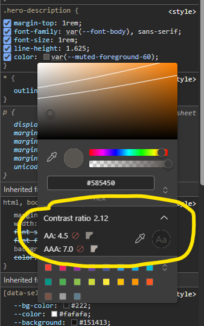

# Exercice 02 : Contrastes

Vous êtes sur votre téléphone, en plein soleil.

Ou peut-être avez-vous une déficience visuelle.

Dans tous les cas… certains textes de cette page sont difficiles à lire.

Pourquoi ? Le contraste de couleur est insuffisant.

## Votre mission

Améliorer les contrastes pour rendre le contenu lisible par tous·es.

## Avant de coder

- Essayez de lire la page rapidement : qu’est-ce qui vous pose problème ?
- Utilisez un outil pour mesurer le contraste

**Extension WCAG Color contrast**

- [Chrome](https://chromewebstore.google.com/detail/wcag-color-contrast-check/plnahcmalebffmaghcpcmpaciebdhgdf)
- [Firefox](https://addons.mozilla.org/fr/firefox/addon/wcag-contrast-checker/)

**Color picker du navigateur Chrome/Edge**

Si vous ne voulez pas installer d'extension, vous pouvez vous aider du Color Picker intégré à votre inspecteur de code (F12).

1. **Ouvrir l'inspecteur** : Faites un clic droit sur l'élément concerné (`
`) et choisissez Inspecter (ou Inspecter l'élément).
2. **Repérer la propriété de couleur** : Dans l'onglet Styles, cherchez la ligne de code correspondant à la couleur. C'est souvent **color** pour le texte ou **background-color** pour le fond.
3. Cliquez sur **la valeur de couleur** : Cliquez directement sur la valeur hexadécimale ou sur le petit carré de couleur à gauche de la valeur.

- Note : Si la couleur utilise une variable CSS (comme var(...)), l'inspecteur peut vous demander de cliquer sur la petite icône de "loupe" ou de "déroulant" pour voir la valeur réelle calculée, ou vous devrez cliquer sur la valeur calculée si elle est affichée en dessous. Dans votre image, la couleur est affichée via une variable, mais le sélecteur est apparu, ce qui signifie que le navigateur a résolu la couleur.

4. **Le sélecteur de couleurs s'ouvre** : Une fenêtre s'affiche. Vous y verrez :

- Un dégradé pour choisir la teinte.
- Une barre spectrale pour ajuster la saturation et la luminosité.
- Un curseur de transparence (alpha).
- La valeur hexadécimale actuelle.
- Des informations sur le contraste (Contrast ratio, AA, AAA).

Ce sont les informations sur le contraste qui nous intéressent pour vérifier la couleur du texte ou du fond comme le suggère ce capture d'écran. 

En cliquant sur les carrés à côté des ratios AA et AAA, cela va vous appliquer les bonnes couleurs pour corriger les problèmes de contrastes.

## À savoir

Qu'est-ce qu'un contraste de couleur ?

La lisibilité du texte dépend du contraste de couleur, c’est-à-dire de la différence de luminosité perçue entre le texte et son fond.

Ce contraste se mesure mathématiquement selon des normes d'accessibilité une échelle de **1:1** (aucun contraste) à **21:1** (contraste maximum).
Plus la différence est grande, plus le contraste est fort et la lecture est claire.

## Corriger le test avec Playwright

Lancer la commande :

`npx playwright test exercice02`

[Voir le test](../../tests/exercice02.spec.ts)
